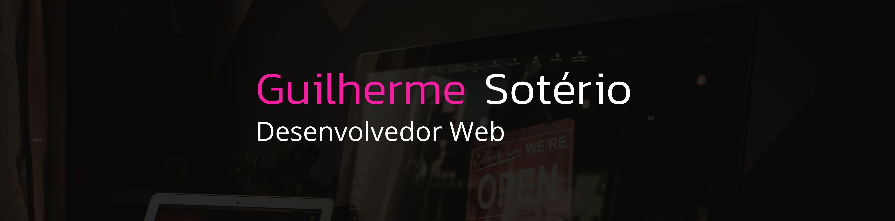

 
<h2>Hello</h2>
  

  

Web Systems Student at the Federal Institute of Brasília. My priority today is my professional development. With a stack focused on web development: Javascript, React, Java, Spring, GoLang, pre-processors like Sass and Less and automation tools like Gulp. I seek an opportunity to generate value and deliver results.

  
At the beginning of my career, I sought to inform myself and analyze the demands of technology companies, understanding that specializing in a specific area is the best way to become more efficient as a developer.
This led me to know Javascript, which is my main language, and I develop it with React, but I also study Redux, NestJs and PWA.
In addition I dedicate a part of my time to other backend languages like Java and GoLang to bring me more versatility, molding myself with a skillset more full stack.

 

<table>
  <tr>
  <td></td>
  <td></td>
</tr>   
</table>

